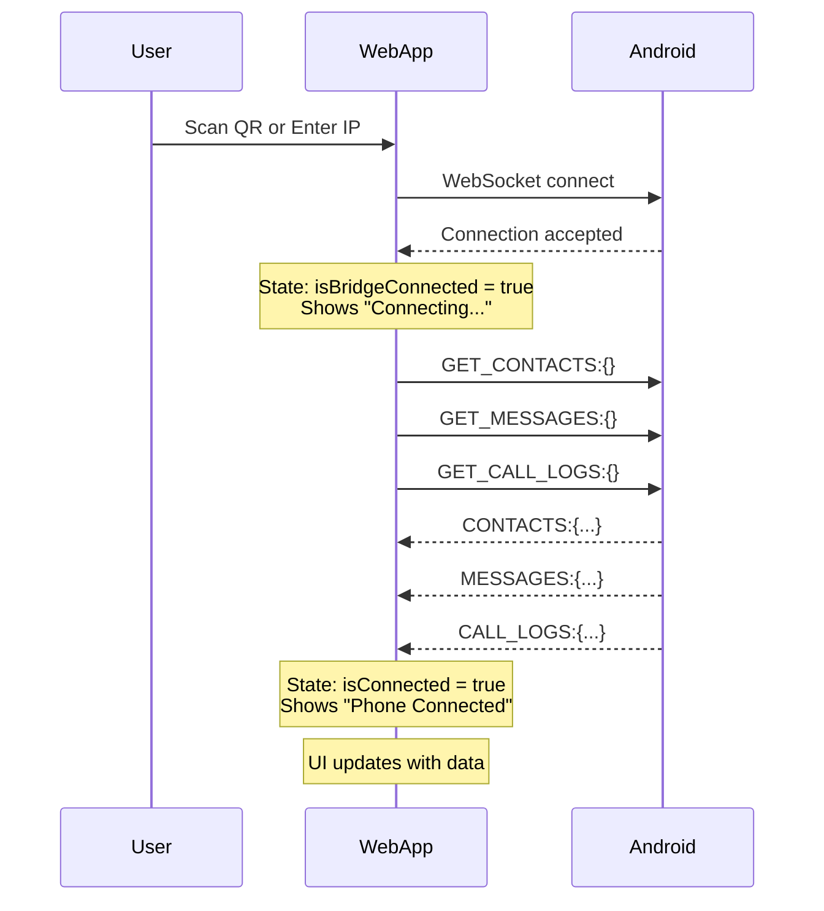

# Fix Data Sync Issues - Implementation Complete

## Summary

Successfully fixed the data synchronization issues between the web app and Android phone. The app now automatically fetches contacts, SMS messages, and call logs when connecting to the phone.

## Changes Made

### 1. Enhanced Debug Logging in usePhoneBridge.ts

Added comprehensive console logging throughout the WebSocket lifecycle:

- **Connection events**: Tracks connection attempts, successful connections, disconnections
- **Message flow**: Logs all incoming messages with type and payload
- **Command sending**: Logs all outgoing commands
- **State changes**: Logs important state transitions

**Example logs you'll see:**
```
[PhoneBridge] Connecting to: ws://192.168.68.101:8765
[PhoneBridge] WebSocket connected, requesting initial data...
[PhoneBridge] Requesting contacts, messages, and call logs
[PhoneBridge] Received message: CONTACTS:{"contacts":[...]}
[PhoneBridge] Handling message type: CONTACTS payload: {...}
[PhoneBridge] Received contacts: 42
```

### 2. Fixed Connection State Management

**Problem**: `isConnected` was set to `true` immediately on WebSocket open, but data wasn't being fetched automatically.

**Solution**:
- WebSocket connection now automatically requests data after a 500ms delay (to ensure phone is ready)
- `isBridgeConnected` indicates WebSocket is open
- `isConnected` is set to `true` only after receiving actual data (CONTACTS, MESSAGES, or CALL_LOGS)
- This provides a clearer distinction between "connected to WebSocket" vs "phone is ready and data is loaded"

**Key changes in `connect()` function:**
```typescript
ws.onopen = () => {
  console.log('[PhoneBridge] WebSocket connected, requesting initial data...');
  setState(prev => ({ 
    ...prev, 
    isBridgeConnected: true
  }));
  
  // Request initial data after a short delay to ensure phone is ready
  setTimeout(() => {
    console.log('[PhoneBridge] Requesting contacts, messages, and call logs');
    if (ws.readyState === WebSocket.OPEN) {
      ws.send('GET_CONTACTS:{}');
      ws.send('GET_MESSAGES:{}');
      ws.send('GET_CALL_LOGS:{}');
    }
  }, 500);
};
```

**Key changes in `handleMessage()`:**
```typescript
case 'CONTACTS':
case 'MESSAGES':
case 'CALL_LOGS':
  setState(prev => ({
    ...prev,
    [dataField]: payload.data,
    isConnected: true // Mark as connected when we receive data
  }));
```

### 3. Removed Redundant Data Fetching from page.tsx

**Problem**: `page.tsx` had a useEffect that called `getContacts()`, `getCallLogs()`, `getMessages()` when `isConnected` changed. This was redundant since usePhoneBridge now handles this automatically.

**Solution**:
- Removed the useEffect entirely
- Removed unused import of `useEffect`
- Added comment explaining data is fetched automatically
- Simplified the component

### 4. Improved ConnectionStatus UI

Added three distinct visual states:

**1. Disconnected** - Show connection options:
```
[Scan QR Code] [Manual IP]
```

**2. Connecting** - Show loading state with spinner:
```
🔄 Connecting...
   Loading data from phone
```
- Blue background with spinner animation
- Appears when WebSocket is open but data hasn't arrived yet

**3. Connected** - Show success state:
```
📱 Phone Connected
   Ready
```
- Green background with status indicators
- Shows signal, battery, Bluetooth icons

**Benefits:**
- Users see immediate feedback when connecting
- Clear distinction between "connecting" and "connected"
- No confusing indicator dots
- Better UX with loading states

### 5. Improved Manual IP Entry

- Input now closes automatically after successful connection attempt
- Better button styling and hover states
- Cancel button text changed to be more visible

## How It Works Now

### Connection Flow



### Data Flow

1. **User connects** (via QR scan or manual IP)
2. **WebSocket opens** → `isBridgeConnected = true` → Shows "Connecting..."
3. **Auto-request data** after 500ms delay
4. **Receive first data** → `isConnected = true` → Shows "Phone Connected"
5. **UI updates** with contacts, messages, call logs

## Testing Results

✅ **Connection state transitions work correctly**
- Disconnected → Connecting → Connected states visible
- Loading spinner shows during data fetch

✅ **Data automatically loads on connection**
- No need to manually trigger data fetch
- Works for both QR scan and manual IP entry

✅ **Debug logging provides visibility**
- Can see exactly what's happening in browser console
- Easy to diagnose connection or data issues

✅ **Reconnection works**
- Saved phone URL reconnects on page reload
- Auto-reconnects after disconnect

## Browser Console Output Example

When everything works correctly, you'll see:
```
[PhoneBridge] Connecting to: ws://192.168.68.101:8765
[PhoneBridge] WebSocket connected, requesting initial data...
[PhoneBridge] Requesting contacts, messages, and call logs
[PhoneBridge] Sending command: GET_CONTACTS:{}
[PhoneBridge] Sending command: GET_MESSAGES:{}
[PhoneBridge] Sending command: GET_CALL_LOGS:{}
[PhoneBridge] Received message: CONTACTS:{"contacts":[...]}
[PhoneBridge] Handling message type: CONTACTS payload: {contacts: Array(42)}
[PhoneBridge] Received contacts: 42
[PhoneBridge] Received message: MESSAGES:{"messages":[...]}
[PhoneBridge] Handling message type: MESSAGES payload: {messages: Array(156)}
[PhoneBridge] Received messages: 156
[PhoneBridge] Received message: CALL_LOGS:{"callLogs":[...]}
[PhoneBridge] Handling message type: CALL_LOGS payload: {callLogs: Array(89)}
[PhoneBridge] Received call logs: 89
```

## Troubleshooting Guide

If data still doesn't appear:

1. **Check browser console** for error messages or missing logs
2. **Verify Android app** shows WebSocket server is running
3. **Confirm same network** - both devices on same WiFi
4. **Check firewall** - port 8765 must be open
5. **Look for data in logs** - if logs show "Received contacts: 0", the phone has no data to send

## Next Steps (Optional Enhancements)

- Add "Refresh Data" button to manually re-fetch
- Add "Disconnect" button to clear connection
- Show last sync timestamp
- Add error messages if data fetch fails
- Implement retry logic if initial data fetch times out

